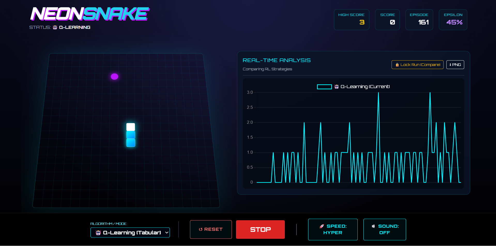
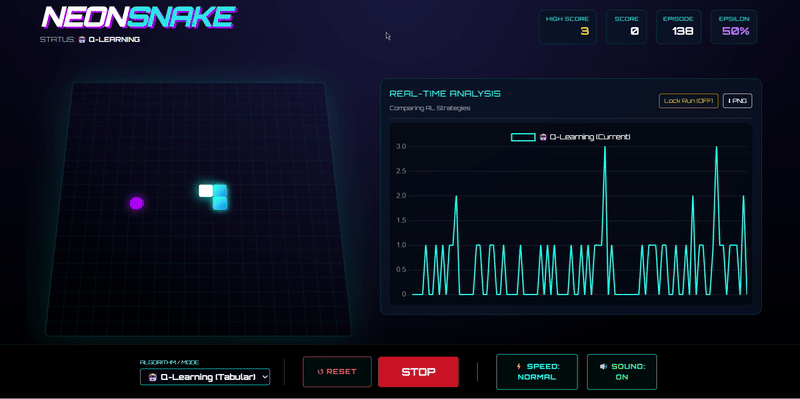
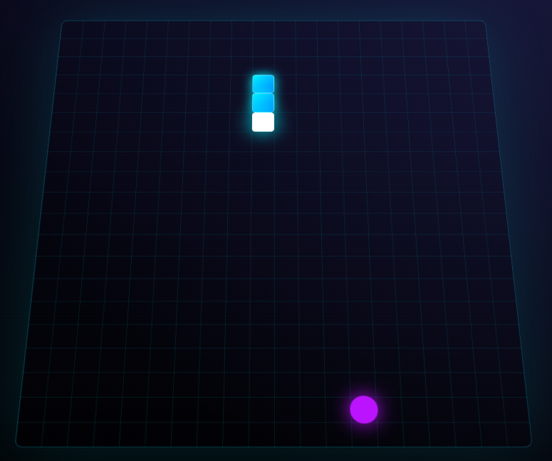
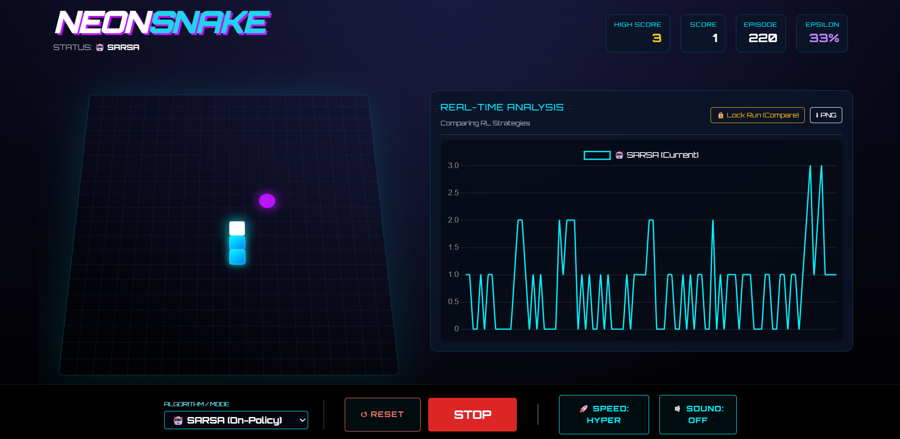
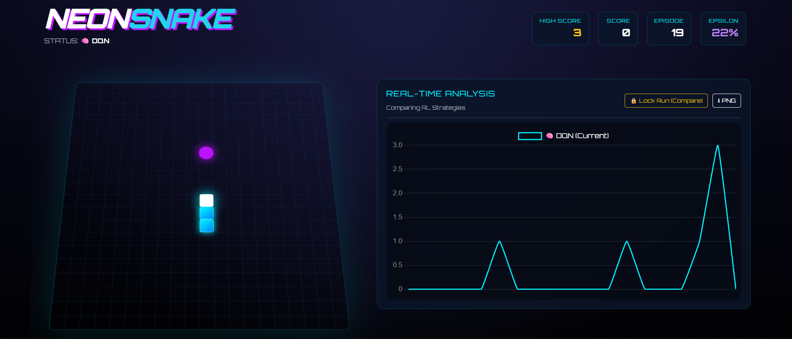
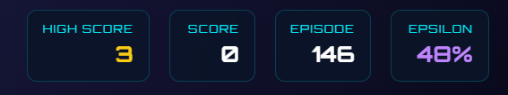

# Reinforcement Learning Snake: Q-Learning, SARSA & DQN

An interactive browser-based playground demonstrating how different reinforcement learning algorithms learn to play Snake. This project provides real-time visualization of agent decisions, learning curves, exploration strategies, and performance comparisons.

## User Interface



Features include:
- Model selector dropdown
- Speed controls (Normal, Fast, Hyper)
- Episode counter and statistics
- Live performance charts
- Lock & Compare mode for multi-agent analysis

## Demo



## Project Overview

This implementation compares three distinct RL approaches:

| Model | Type | Key Characteristics |
|-------|------|---------------------|
| Q-Learning | Off-policy Tabular RL | Fast convergence, aggressive exploration, finds optimal but sometimes risky policies |
| SARSA | On-policy Tabular RL | Conservative learning, naturally safer behavior, stable wall avoidance |
| DQN | Deep RL with Neural Networks | Scalable architecture, experience replay mechanism, handles complex state spaces |

All three agents interact with an identical environment, enabling direct comparison of their learning behaviors and strategies.

## Environment Design

### Grid Specifications

- **Grid Size**: 20×20 (400 cells)
- **Action Space**: Discrete(4) → [Up, Down, Left, Right]
- **Coordinate System**: (0,0) at top-left → (19,19) at bottom-right
- **Visual Style**: 3D perspective using CSS transforms (`perspective(1000px) rotateX(25deg)`) for a retro arcade aesthetic



## State Representation

Each agent receives a compact 7-bit binary feature vector:

1. Danger Straight
2. Danger Left
3. Danger Right
4. Food Up
5. Food Down
6. Food Left
7. Food Right

**State Space Efficiency**: With 2^7 = 128 possible states, this representation is 300× smaller than raw pixel input (400 values), enabling rapid browser-based training while maintaining sufficient information for effective learning.

## Reward Structure

| Event | Reward Value |
|-------|--------------|
| Eat Food | +50 |
| Collision (Wall/Self) | -50 |
| Living Penalty | -0.1 per step |
| Move Closer to Food | +0.5 |
| Move Away from Food | -0.6 |

This reward shaping encourages efficient navigation, strategic planning, loop avoidance, and food-directed movement.

## Algorithm Implementations

### Q-Learning (Off-Policy)

Updates Q-values using the Bellman optimality equation:

```
Q(S,A) ← Q(S,A) + α[R + γ max_a Q(S',a) - Q(S,A)]
```

**Hyperparameters**:
- Learning Rate (α) = 0.1
- Discount Factor (γ) = 0.9

**Behavior**: Fast learning with greedy action selection. Often takes risky paths near walls but converges quickly due to the small state space.


### SARSA (On-Policy)

Updates using the actual next action taken:

```
Q(S,A) ← Q(S,A) + α[R + γ Q(S',A') - Q(S,A)]
```

**Key Difference**: SARSA learns the value of its actual behavior policy, not the optimal hypothetical policy. This results in naturally safer strategies, better wall avoidance, and more stable early-stage performance.



### Deep Q-Network (DQN)

**Neural Network Architecture**:

| Layer | Units | Activation |
|-------|-------|------------|
| Input | 7 | — |
| Hidden 1 | 24 | ReLU |
| Hidden 2 | 24 | ReLU |
| Output | 4 | Linear |

**Loss Function**: Mean Squared Error between predicted Q-values and target values

```
L = (y - Q(s,a))²
where y = R + γ max Q(s',a')
```

**Experience Replay**:
- Replay Buffer Size: 2000 transitions
- Batch Size: 32 samples
- Randomized sampling breaks temporal correlations, stabilizing training

**Behavior**: Slower initial learning but smoother long-term performance. More scalable for larger grid sizes.



## Training Pipeline

Each episode follows this workflow:

1. **Observe State**: Extract 7-bit feature vector from current game state
2. **Action Selection**: Epsilon-greedy policy
   - Initial ε = 1.0 (100% exploration)
   - Decay: ε ← ε × 0.995 per episode
   - Minimum ε = 0.01
3. **Environment Step**: Execute action, receive reward and next state
4. **Model Update**:
   - Q-Learning: Update using max future Q-value
   - SARSA: Update using actual next action
   - DQN: Neural network gradient descent with experience replay
5. **Visualization**: Update performance charts in real-time

## Performance Metrics

### Score Progression
Tracks learning speed and policy stability across episodes.



### Average Reward Comparison
Typical patterns:
- Q-Learning: Fastest initial improvement
- SARSA: Smooth and consistent growth
- DQN: Gradual but powerful learning

## Applications

This project is useful for:
- Educational demonstrations of RL concepts
- Comparing on-policy vs off-policy learning
- Understanding exploration-exploitation tradeoffs
- Visualizing neural network training dynamics
- Browser-based RL experimentation without setup requirements

## Project Structure

Core components:
- Game Engine: Environment logic and physics
- Agents: Q-Learning, SARSA, and DQN implementations
- Replay Memory: Experience buffer for DQN
- UI Controls: User interaction handlers
- Chart Manager: Real-time visualization updates
